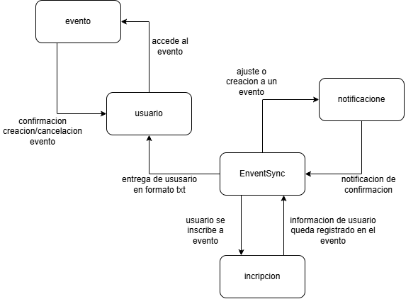
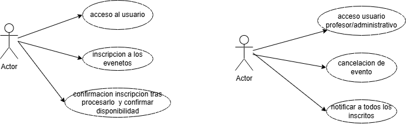

# DOSW_ParcialT1_CamiloLeon

# punto_1

=======

# punto_2

Los patrones que se pueden usar para este son:

EL creacional - Factory Method: este para la creacion de diferentes metodos para cada uno de los eventos creados o cancelados
para que se puedana accerder a ellos si soncreados o no para poder agregar sus requerimientos, horarios y cancelarlos de ser necesarios

De comportamiento - strategy: esto para optimizar el tiepo de ejecuacion en las diferentes solicitudes que se hagan en referencia a los eventos
para las multiples solicitudes de inscripcion, creacion o cancelacion de eventos que pueden suceder al mismo tiempo, para que el patron las ponga en
lista de espera y las pueda ateder de manera mas eficiente.

# punto 3

requerimientos funcionales:
- Creacion de eventos dandoles iformacion como duracion, fecha y requerimientos necesarios.
- que sea posible la realizacion de inscripcion a los eventos disponibles y activos usando los patrones de diseño para controlar de mejor manera las multiples solicitudes.
- la posibilidad de cnacelr los eventos siempre y cuando posea los permisos disponibles segun el tipo de usuario que sea.

requerimientos no funcionales:
- interfaz con los colores de la universidad con las imagenes alegoricas a cada evento.
- manejar lengiuaje adecuado para los usuarios y con una fuente deacuerdo a la institucion.

# punto 4

# punto 5

### Requerimiento Funcional 1

| Campo | Descripción |
|------|-------------|
| **ID** | RF-01 |
| **Nombre del requerimiento** | inscripcion a eventos |
| **Descripción** | el sistema debe de poder recibir las solicitude sde inscripcion de los aspirantes, mediante los patrones de diseñoprocesar la solicitud que cumpla con los requisitos y haya cupos disponible y retornas la notificacion de confirmacion |
| **Precondiciones** | para cumplir con esto el sistema ya debe de contar con los eventos creados con su informacion y requerimientos determinados y el sistema de notificaciones |
| **Actor** | actor en diagramas |
| **Flujo principal** | 1. El actor  2. El sistema EventSync recibe la solicitud  3. El sistema determina si es posible o no y retorna la notificacion |
| **Diagrama de caso de uso** | *imagen y link*|
| **Poscondiciones** | *Se espera como resultado la correcta funcionalidad de manejo de cupos al quedar registrados |

### Requerimiento Funcional 2

| Campo | Descripción |
|------|-------------|
| **ID** | RF-02 |
| **Nombre del requerimiento** | Cancelacion de eventos|
| **Descripción** | *El sistema debe de poder cancelar eventos si un usuario autorizado sea profesor o administrativo dependiento del evento creado. |
| **Precondiciones** | *Para que el sistema cumpla con este requerimiento, Bankify debe tener previamente completa la opcion de crear los eventos con sus condiciones de quien los crea sea profesor o administrativo* |
| **Actor** | actor en diagramas  |
| **Flujo principal** | 1. El actor … 2. El sistema accede a los eventos creados  3. El sistema da la opcion de eliminar el evento, borraandolo de la base de datos  4. se le notifica a los usuarios registrados la cancelacion del evento. |
| **Diagrama de caso de uso** | en diagramas|
| **Poscondiciones** | *Se espera como resultado la elimacion del evento de la base de datos y que la notificacion de dicha accion llegue a todos los usuario registrados. |

